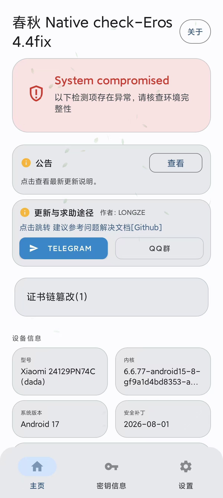
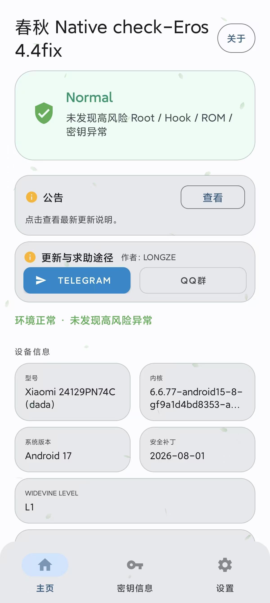

# 安全启动状态修复

  
  
  
  
  
  

专为解决安卓环境检测中提示证书链篡改问题开发的轻量模块。通过把系统属性 `ro.secureboot.lockstate` 锁定为 `locked`，刷入后立即生效，手机重启也会自动保持锁定。

---

## 快速下载

| 项目 | 下载链接 | 文件大小 | SHA256 校验码 |
| :--- | :--- | :--- | :--- |
| **最新发布页** | [前往 Releases 下载](https://github.com/Rikka06/lockstate-fix/releases/latest) | ~2.8 KB | `59d9a60bd9fe8e1959c9fdad3e408ad4327cb0398768a6901082a87e8ba07fc7` |
| **仓库直链** | [LockstateFix-v1.0.0.zip](https://github.com/Rikka06/lockstate-fix/raw/main/LockstateFix-v1.0.0.zip) | ~2.8 KB | `59d9a60bd9fe8e1959c9fdad3e408ad4327cb0398768a6901082a87e8ba07fc7` |

---

## 效果对比

| 修复前 报错证书链篡改 | 修复后 状态锁定正常 |
| :---: | :---: |
|  |  |

---

## 主要特点

- **即刷即用**：刷入后马上生效，不需要手动重启手机。
- **开机自启**：开机后自动检查并锁定，防止重启后失效。
- **一键自检**：在模块管理器里点击 Action 按钮可以随时测试当前状态。
- **简单干净**：没有常驻后台，不占内存，不耗电。

---

## 支持环境

| 项目 | 范围 |
| :--- | :--- |
| **Root 管理器** | KernelSU、SukiSU、APatch、Magisk |
| **安卓版本** | Android 9 及以上 |
| **处理器架构** | ARM64、ARM、x86_64 |

---

## 使用方法

1. 下载模块压缩包 `LockstateFix-v1.0.0.zip`
2. 打开手机上的 KernelSU、SukiSU、Magisk 或 APatch 管理器
3. 进入模块界面，点击从本地安装并选择下载的文件
4. 刷入成功后即可直接打开检测软件查看效果

---

## 致谢与参考

- 核心属性思路：酷安 @JeTeeZnTmaxQwQ
- 检测参考文档：[Chunqiu-Detector-Problem-solution](https://github.com/mingzun09/Chunqiu-Detector-Problem-solution)
- 编写辅助：Gemini 3.7 Flash

---

## 交流与联系

- 开发者: XIAN
- QQ 交流群: 605389940
- 酷安: [访问主页](https://www.coolapk.com/u/3564176)
- 哔哩哔哩: [访问个人空间](https://b23.tv/Zks8L7W)
- 抖音: [访问主页](https://v.douyin.com/oFVtoEuk6yQ/)

---

## 开源协议

本项目基于 GPL-3.0 协议开源。

